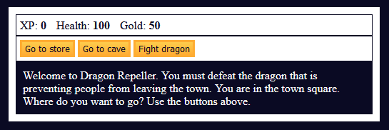

# JavaScript RPG - Dragon Repeller

Welcome to Dragon Repeller, an interactive role-playing game where players can track stats, buy weapons, and fight monsters. The ultimate goal? Defeat the dragon that's terrorizing the town!

This project is part of a practice exercise from [freeCodeCamp](https://www.freecodecamp.org/learn/javascript-algorithms-and-data-structures-v8/#learn-basic-javascript-by-building-a-role-playing-game).

## Features

- **Track Stats**: Players can monitor their XP, health, and gold.

- **Buy Weapons and Items**: Visit the store to upgrade weapons or heal.

- **Battle Monsters**: Fight against various creatures, including the ultimate dragon.

- **Dynamic Inventory System**: Collect and manage weapons as you progress.

- **Multiple Locations**: Explore the town square, store, cave, and more.

- **Easter Egg**: Discover a *secret* game for extra rewards.

## Technologies Used

- **HTML5**: Structuring the game interface.

- **CSS3**: Styling the game elements and layout.

- **JavaScript**: Core game logic and interactivity.

## Game Mechanics

### Locations

- **Town Square**: The central hub where you start your journey.

- **Store**: Purchase health or upgrade your weapons.

- **Cave**: Fight monsters to earn XP and gold.

- **Fight**: Engage in battles with different creatures.

### Weapons

Weapons improve your attack power. Start with a simple stick and upgrade to:

    - Dagger

    - Claw Hammer

    - Sword

### Monsters

Battle against:

    - Slime (Level 2)

    - Fanged Beast (Level 8)

    - Dragon (Level 20)

### Controls

Use the buttons provided to navigate between locations, fight monsters, or make decisions.
